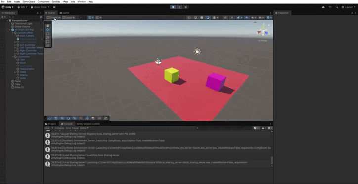

# Practica-06

Tras realizar la configuracion realizada para el fichero que se indica en el gíon de la actividad pasamos a desarrolar los scrips de [sp1](CambioColor.cs) y [sp2](AgarrarCubo.cs).

El **CambioColor** permite que un objeto cambie de color cada vez que es seleccionado mediante un Ray Interactor.
Para ello, se obtiene el componente **MeshRenderer** del objeto y, en el momento en que el usuario lo selecciona, se genera un nuevo color aleatorio (usando Random).
De esta forma, cada vez que el usuario interactúa con el cubo lejano, su color cambia de manera distinta.

El **AgarrarCubo** controla el comportamiento del cubo cercano que se agarra directamente con  un Direct Interactor.
Cuando el usuario agarra el cubo, el método **AlAgarrar** muestra en la consola de Unity un mensaje indicando que el cubo ha sido tomado.
De igual manera, cuando el usuario lo suelta, el método **AlSoltar** imprime otro mensaje indicando que el objeto ha sido liberado.

